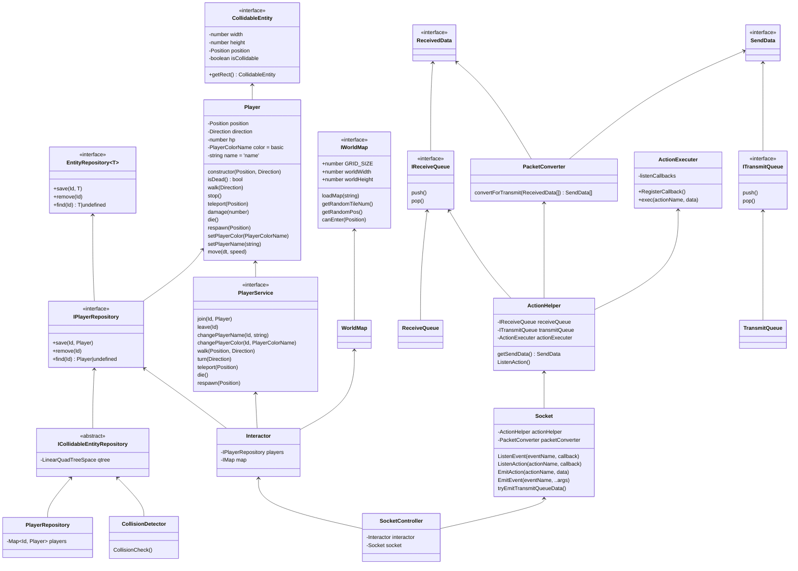

```mermaid
  classDiagram

  <!-- flowdirection TB -->

  EntityRepository~T~ <-- IPlayerRepository
  class EntityRepository~T~ {
    <<interface>>
    +save(Id, T)
    +remove(Id)
    +find(Id) T|undefined
  }


  IPlayerRepository <-- ICollidableEntityRepository
  IPlayerRepository <-- Interactor
  class IPlayerRepository {
    <<interface>>
    +save(Id, Player)
    +remove(Id)
    +find(Id) Player|undefined
  }


  class PlayerRepository {
    -Map~Id, Player~ players
  }

  ICollidableEntityRepository <-- PlayerRepository
  ICollidableEntityRepository <-- CollisionDetector
  class ICollidableEntityRepository {
    <<abstract>>
    -LinearQuadTreeSpace qtree
  }

  CollidableEntity <-- Player
  class CollidableEntity {
    <<interface>>
    -number width
    -number height
    -Position position
    -boolean isCollidable
    +getRect() CollidableEntity

  }

  class CollisionDetector {
    CollisionCheck()
  }

  Player <-- IPlayerRepository
  Player <-- PlayerService
  class Player {
    -Position position
    -Direction direction
    -number hp
    -PlayerColorName color = basic
    -string name = 'name'

    constructor(Position, Direction)
    isDead() bool
    walk(Direction)
    stop()
    teleport(Position)
    damage(number)
    die()
    respawn(Position)
    setPlayerColor(PlayerColorName)
    setPlayerName(string)

    move(dt, speed)  <!--バックエンド用-->

  }

  PlayerService <-- Interactor
  class PlayerService {
    <<interface>>
    join(Id, Player)
    leave(Id)
    changePlayerName(Id, string)
    changePlayerColor(Id, PlayerColorName)
    walk(Position, Direction)
    turn(Direction)
    teleport(Position)
    die()
    respawn(Position)
  }

  Interactor <-- SocketController
  class Interactor {
    -IPlayerRepository players
    -IMap map
  }

  IWorldMap <-- WorldMap
  class IWorldMap {
    <<interface>>
    +number GRID_SIZE
    +number worldWidth
    +number worldHeight
    loadMap(string)
    getRandomTileNum() <!--引数で侵入不可マスを含めるか設定？-->
    getRandomPos() <!--引数で侵入不可マスを含めるか設定？-->
    canEnter(Position)
  }

  WorldMap <-- Interactor
  class WorldMap {

  }

  ITransmitQueue <-- TransmitQueue
  class ITransmitQueue {
    <<interface>>
    push()
    pop()
  }

  class TransmitQueue {

  }

  IReceiveQueue <-- ReceiveQueue
  IReceiveQueue <-- ActionHelper
  class IReceiveQueue {
    <<interface>>
    push()
    pop()
  }

  class ReceiveQueue {

  }

  ActionExecuter <-- ActionHelper
  class ActionExecuter {
    -listenCallbacks
    +RegisterCallback()
    +exec(actionName, data)
  }


  PacketConverter <-- ActionHelper
  class PacketConverter {
    convertForTransmit(ReceivedData[]) SendData[]
  }

  ReceivedData <-- IReceiveQueue
  ReceivedData <-- PacketConverter
  class ReceivedData {
    <<interface>>
  }

  SendData <-- PacketConverter
  SendData <-- ITransmitQueue
  class SendData {
    <<interface>>
  }

  ActionHelper <-- Socket
  class ActionHelper {
    -IReceiveQueue receiveQueue
    -ITransmitQueue transmitQueue
    -ActionExecuter actionExecuter

    getSendData() SendData
    ListenAction()
  }

  Socket <-- SocketController
  class Socket {
    -ActionHelper actionHelper
    -PacketConverter packetConverter
    ListenEvent(eventName, callback)
    ListenAction(actionName, callback)
    EmitAction(actionName, data)
    EmitEvent(eventName, ..args)
    tryEmitTransmitQueueData()
  }


  class SocketController {
    -Interactor interactor
    -Socket socket
  }
```
