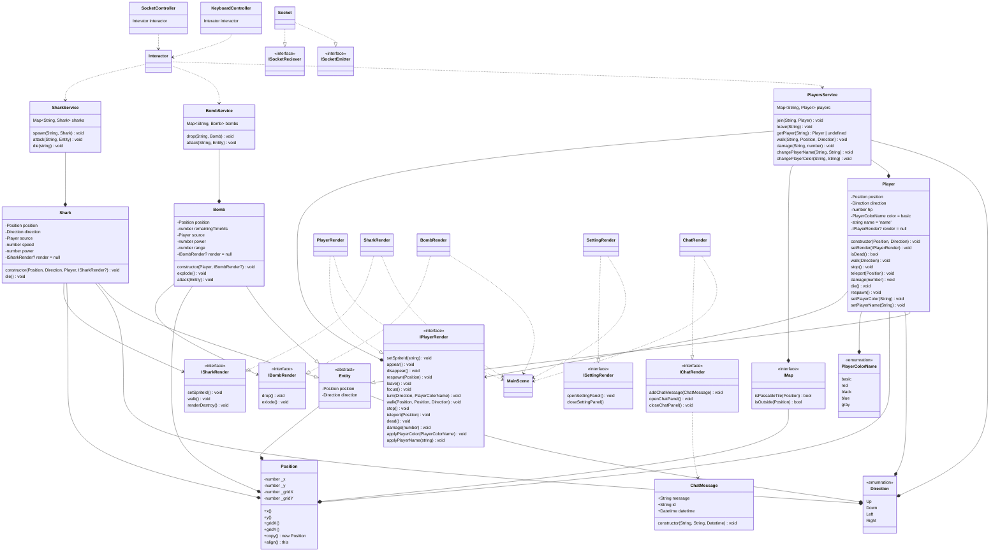

# クラス図

```mermaid
classDiagram
    class Direction {
        <<emumration>>
        Up
        Down
        Left
        Right
    }

    class Position {
        -number _x
        -number _y
        -number _gridX
        -number _gridY
        +x()
        +y()
        +gridX()
        +gridY()
        +copy() new Position
        +align() this
    }

    class PlayerColorName {
        <<emumration>>
        basic
        red
        black
        blue
        gray
    }

    Entity --* Direction
    Entity --* Position

    class Entity {
      <<abstract>>
      -Position position
      -Direction direction
    }

    Player --|> Entity
    Player --* Direction
    Player --* Position
    Player --* PlayerColorName
    Player --> IPlayerRender

    class Player {
        -Position position 
        -Direction direction
        -number hp
        -PlayerColorName color = basic
        -string name = 'name'
        -IPlayerRender? render = null

        constructor(Position, Direction) void
        setRender(IPlayerRender) void
        isDead() bool
        walk(Direction) void
        stop() void
        teleport(Position) void <!-- テレポート的なもの -->
        damage(number) void
        die() void
        respawn() void
        setPlayerColor(String) void
        setPlayerName(String) void
    }

    class IPlayerRender {
        <<interface>>
        setSpriteId(string) void
        appear() void
        disappear() void
        respawn(Position) void
        leave() void
        focus() void
        turn(Direction, PlayerColorName) void
        walk(Position, Position, Direction) void
        stop() void
        teleport(Position) void
        dead() void
        damage(number) void
        applyPlayerColor(PlayerColorName) void
        applyPlayerName(string) void
    }

    Shark --|> Entity
    Shark --* Direction
    Shark --* Position
    Shark --> ISharkRender

    class Shark {
        -Position position
        -Direction direction
        -Player source
        -number speed
        -number power
        -ISharkRender? render = null

        constructor(Position, Direction, Player, ISharkRender?) void
        die() void
    }

    class ISharkRender{
        <<interface>>
        setSpriteId() void
        walk() void
        renderDestroy() void
    }

    Bomb --|> Entity
    Bomb --* Position
    Bomb --> IBombRender

    class Bomb {
        -Position position
        -number remainingTimeMs
        -Player source
        -number power
        -number range
        -IBombRender? render = null
        
        constructor(Player, IBombRender?) void
        explode() void
        attack(Entity) void
    }

    class IBombRender {
        <<interface>>
        drop() void
        exlode() void
    }

    class ChatMessage {
        +String message
        +String id
        +Datetime datetime

        constructor(String, String, Datetime) void
    }

    IMap --* Position

    class IMap {
        <<interface>>
        isPassableTile(Position) bool
        isOutside(Position) bool
    }
    
    IChatRender ..> ChatMessage

    class IChatRender {
        <<interface>>
        addChatMessage(ChatMessage) void
        openChatPanel() void
        closeChatPanel() void
    }

    class ISettingRender {
        <<interface>>
        openSettingPanel() void
        closeSettingPanel()
    }

    PlayersService --* Direction
    PlayersService --* Player
    PlayersService --* IMap
    PlayersService --* IPlayerRender

    class PlayersService {
        Map~String, Player~ players
        join(String, Player) void
        leave(String) void
        getPlayer(String) Player | undefined
        walk(String, Position, Direction) void
        damage(String, number) void
        changePlayerName(String, String) void
        changePlayerColor(String, String) void
    }

    BombService --* Bomb

    class BombService {
        Map~String, Bomb~ bombs
        drop(String, Bomb) void
        attack(String, Entity) void
    }

    SharkService --* Shark

    class SharkService {
        Map~String, Shark~ sharks
        spawn(String, Shark) void
        attack(String, Entity) void
        die(string) void
    }

    Interactor ..> PlayersService
    Interactor ..> BombService
    Interactor ..> SharkService

    class Interactor {
    }

    class ISocketEmitter {
        <<interface>>
    }

    KeyboardController ..> Interactor

    class KeyboardController {
        Interator interactor
    }

    SocketController ..> Interactor

    class SocketController {
        Interator interactor
    }

    class ISocketReciever {
        <<interface>>
    }

    Socket ..|> ISocketEmitter
    Socket ..|> ISocketReciever

    class Socket {

    }

    PlayerRender ..> MainScene
    PlayerRender ..|> IPlayerRender

    class PlayerRender {

    }

    SharkRender ..> MainScene
    SharkRender ..|> ISharkRender

    class SharkRender {

    }

    BombRender ..> MainScene
    BombRender ..|> IBombRender

    class SharkRender {

    }

    SettingRender ..> MainScene
    SettingRender ..|> ISettingRender

    class SettingRender {

    }

    ChatRender ..> MainScene
    ChatRender ..|> IChatRender 
    
    class ChatRender {

    }

    class MainScene {

    }
```
