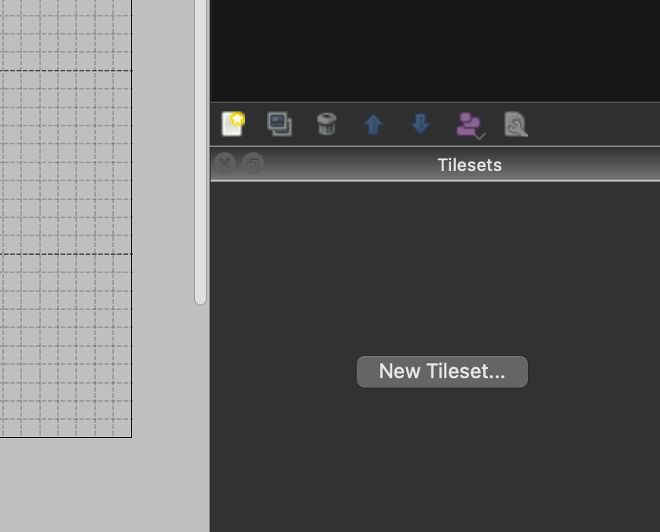
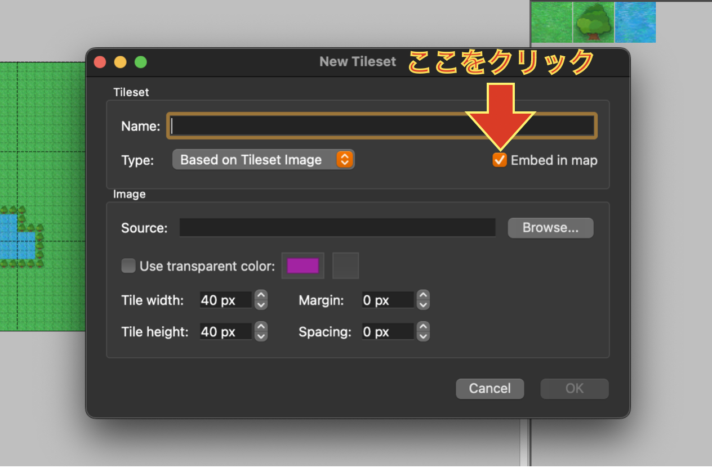
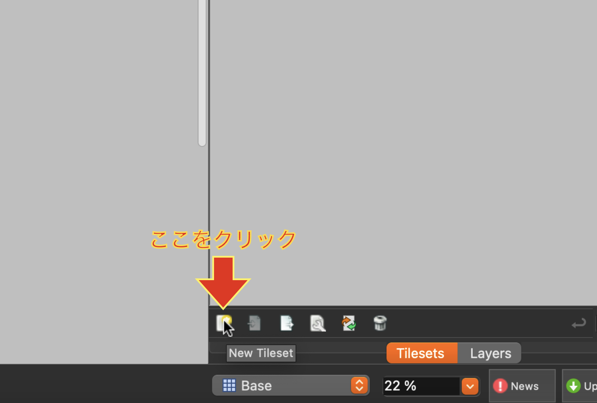
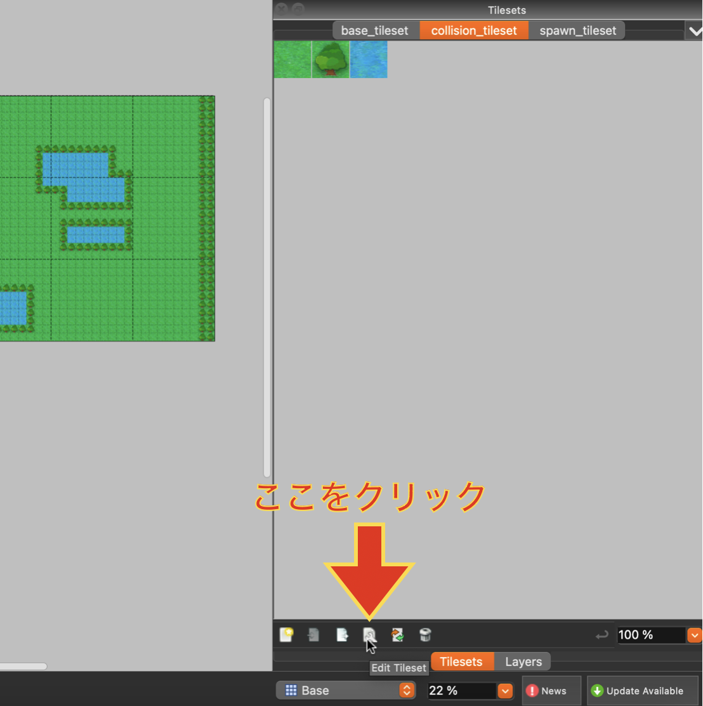
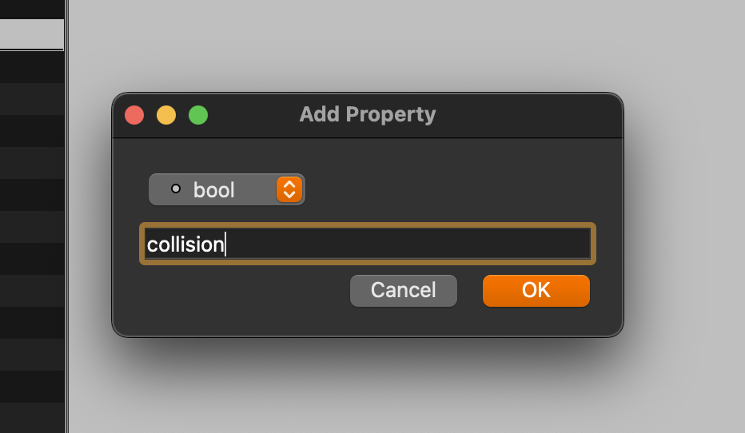
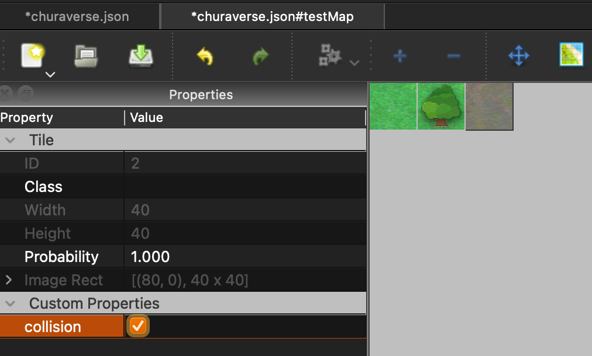

# tiledMapEditor のダウンロード

tiledMapEditor の[公式サイト](https://www.mapeditor.org/)からインストールできます.

# マップ作成・編集

## マップの作成

1. アプリを開き **New Map** からマップを作成します.
2. tile size は 40×40 に設定, Map size は作りたいマップに合わせて適当なサイズに設定します.
3. 作成する Map を json 形式で`/frontend/public/assets/maps/data/`の中に保存します.
4. **[レイヤーの作成](#レイヤーの作成)** に進みます.

## レイヤーの作成

描画用, 進入不可用, スポーン用のレイヤーがあり, それぞれレイヤーを作成する必要があります.

| layer 名  | 機能                                     |
| --------- | ---------------------------------------- |
| Base      | 描画用                                   |
| Collision | 進入不可マスを配置します                 |
| Spawn     | プレイヤーのスポーン可能マスを配置します |

1. tiledMapEditor の右下にある layers タブを選択します.
2. layers ウィンドウの内部で右クリックし\[New\] -> \[Tile Layer\]を選択します.
3. 上記の 3 つ分の layer を作成し, それぞれに表の layer 名をつけます.layer 名は既存のレイヤーのレイヤー名部分をダブルクリックすることで変更可能です.
4. 終了次第 **[タイルセットの作成](#タイルセットの作成)** に進みます.

## タイルセットの作成

以下の手順を繰り返し, Base, Collision, Spawn の 3 レイヤー分の「描画タイルセット」,「進入不可タイルセット」,「スポーンタイルセット」を作成します.

1. 右下の **New Tileset...** をクリックします.

   

2. 画面が以下の写真のように切り替わるので次の手順を進めます.

   1. `Name`に名前を入力します.

      - 命名ルール

        - `レイヤー名_tileset`とします.

        例）`base_tileset`, `collision_tileset`

   2. `Embed in map`のチェックボックスを選択します.

    

   3. `Source`に`map_tile.png`までの相対パスを入力,もしくは入力欄右の`Browse...`から `map_tile.png` を選択します.

3. ２回目以降は`New Tileset...`というボタンは無くなるが, 以下の画像内のカーソルが指しているアイコンをクリックすると追加で作成できます.

   

4. **[タイルにプロパティを付ける](#タイルにプロパティを付ける)** に進みます.

## タイルにプロパティを付ける

タイルにプロパティを追加する方法を説明します.ここでは collision プロパティについてのみ説明するが同じ方法で `spawn_tileset`にもプロパティを追加してください. 各 Tileset に対応する Property については **[Tileset と Property の対応表](#tileset-と-property-の対応表)** で確認してください.

1.  `collision_tileset`が選択されていることを確認したら, 右下の **Tilesets** の下にあるツールバーから **Edit Tileset** を開きます.

    

2.  以下の手順に沿ってすべてのタイルの **Custom Properties** に Property を追加します.

    - Property の追加手順

      1. すべてのタイルを選択

         [shift + クリック]で複数選択できます.

      2. Tileset 編集画面の Properties メニュー左下 + ボタンをクリックします.
      3. ドロップダウンリストから`bool`を選択し, 入力欄に`collision`を入力します.

         

      4. 進入不可にしたいタイルを選択し, チェックボックスにチェックを入れます.

         

3.  編集が終了したら変更を忘れず保存します.

4.  作成した各 Tileset を用いてマップを作成します. その際以下の点に注意してください.
    - 各 layer を対応する tileset を使用します.
    - BaseLayer（描画用）と CollisionLayer, SpawnLayer 間でタイルの位置がずれないようにします.

### **Tileset と Property の対応表**

|          | base_tileset | collision_tileset | spawn_tileset |
| -------- | :----------: | :---------------: | :-----------: |
| property |     なし     |     collision     |     spawn     |

---

## Map の export 方法

1. Map を作成したら保存します.

2. Mac のメニューバーから **File** を選択し, **json 形式**でエクスポートします.

---

## Map の使用方法

### frontend の場合

- Map の名前と json ファイル名をセットにしたオブジェクトを `/frontend/src/game/domain/model/mapConfig.ts` 内に追加します.以下は Map0.json を作成した場合の例です.

> ```javascript
> {
>   mapName: 'Map0',
>   jsonName: 'Map0.json',
> }
> ```

### backend の場合

- frontend に保存された Map0 をコピーして`/backend/src/interface/map/data`に配置します.
