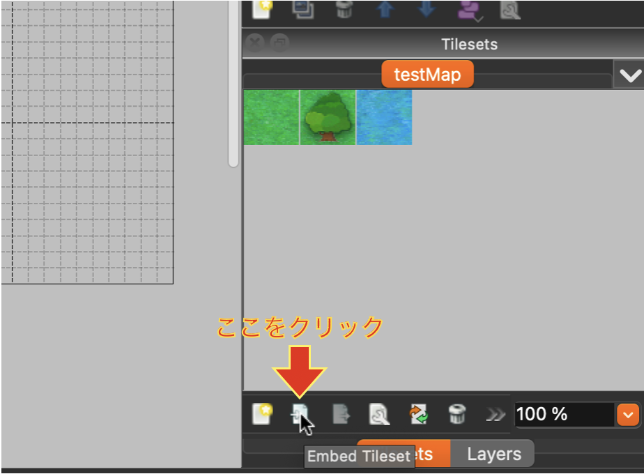
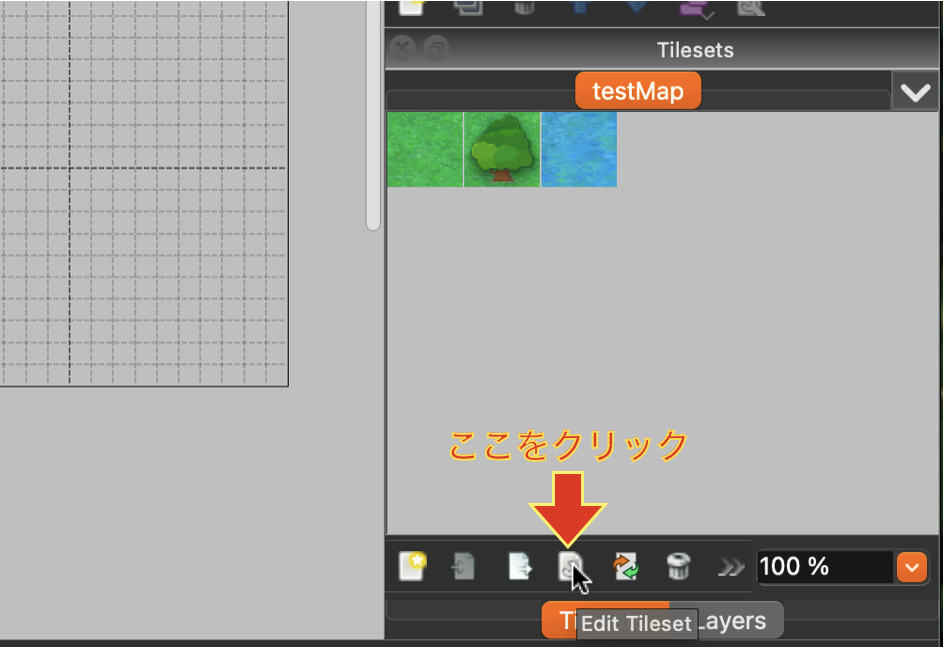

# tiledMapEditor のダウンロード

tiledMapEditor の[公式サイト](https://www.mapeditor.org/)からインストールできます.

# マップ作成・編集

## マップの作成

1. アプリを開き **New Map** からマップを作成する.
2. tile size は 40×40 に設定, Map size は作りたいマップに合わせて適当なサイズに設定する.
3. 作成する Map を json 形式でいったん保存する.
4. **タイルセットの作成**に進む.

## タイルセットの作成

1. ワールドの描画に必要なタイル画像を右下の **New Tilesets** から import する.

   

2. 右下の **Tilesets** の下にあるツールバーから **Embed Tileset** を選択する.

   

3. **タイルに当たり判定を付ける**に進む.

## タイルに当たり判定を付ける（Embed Tileset に設定されている tilesets に対して以下の作業を行う）

1. 右下の **Tilesets** の下にあるツールバーから **Edit Tileset** を開く.

   

2. すべてのタイルの **Custom Properties** に以下の画像と同じ property を作成する.

   

3. 当たり判定を付与したいタイルを選択し「collision」のチェックボックスを入れる.

   

4. 編集が終了したら変更を忘れず保存する.

5. 編集した tile を用いてマップを描画する.

6. **Map の export 方法**に進む.

注意：Map の layer 名を変更する場合は日本語を使用しないで下さい.

---

## Map の export 方法

1. 作成した Map を保存する.

2. メニューバーから**File**を選択し, **json 形式**で export する.

---

## Map の使用方法

### frontend の場合

- export した json を `/frontend/public/assets/maps` に配置する.
- `/frontend/src/game/interface/ui/Render/mapRender.ts` 内の
  `MAP_TILE_JSON_PATH`と`MAP_LAYER_ID`をそれぞれ、作成した Map までの path と Map の Layer 名に変更する.

### backend の場合

- export した json を `/backend/src/interface/map/data` に配置する.
- `/backend/src/server.ts` の以下の`'ファイル名'`部分を使用する json に変更します.

> ```javascript
> void MapManager.build('ファイル名')
> ```
