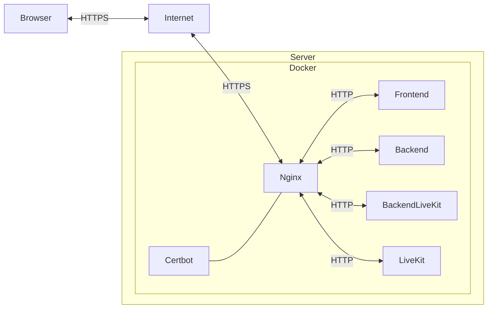
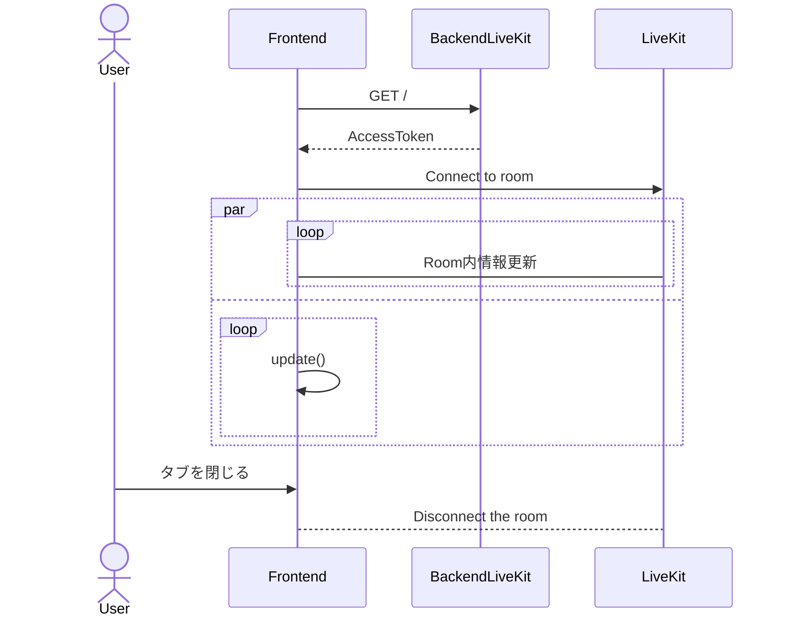

# ビデオ会議機能の技術

ビデオ会議（ボイスチャットやビデオチャット、画面共有）を実装するにあたり、用いた技術をざっくり書いてみます。ざっくりなので詳細は各自でお調べ下さい。

## WebRTCについて

WebRTCとは、Web Real-Time Communicationの略でウェブでリアルタイムなコミュニケーションを実現するための技術です。
接続方式は、大きく分けて「P2P」と「クライアント/サーバー方式」があり、今回は「クライアント/サーバー方式」を採用しています。

用語: WebRTC, P2P, クライアント/サーバー方式

## LiveKitについて

LiveKitとは、WebRTCを使ったビデオ会議アプリケーションを作るためのオープンソースプロジェクトです。サーバーアプリケーション本体及びクライアント向けのSDKなどが提供されています。

用語: LiveKit, SFU, SDK

## HTTPS化

セキュリティが考慮されているということだと思われますが、利用している仕組みの仕様上、マイクやカメラなどのデータを共有するにはHTTPS化を行う必要があります。
今回はNginxとCertbotを使用してHTTPS化を行っています。

用語: Nginx, リバースプロキシ, Certbot, Let's Encrypt, SSL/TLS証明書

## 構成図

## シーケンス図

メインシーンへの遷移後のwebRtcChat.tsの動作

